# Comprehensive EDA Atlas — 2026-08-09

This EDA pass is intentionally dataset-first. It does not promote a model candidate. It documents the column contract, forecast-time contract, spatial topology, label structure, SCADA label-generation evidence, weather-label links, FiCR-sensitive surfaces, and 2025 test shift.

## Figures

1. 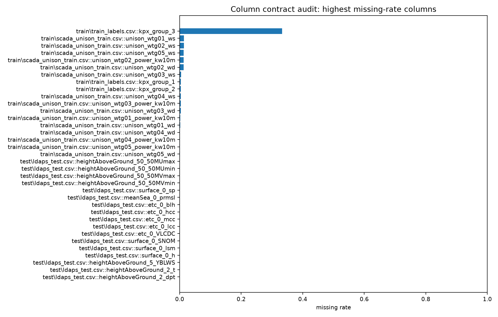
2. 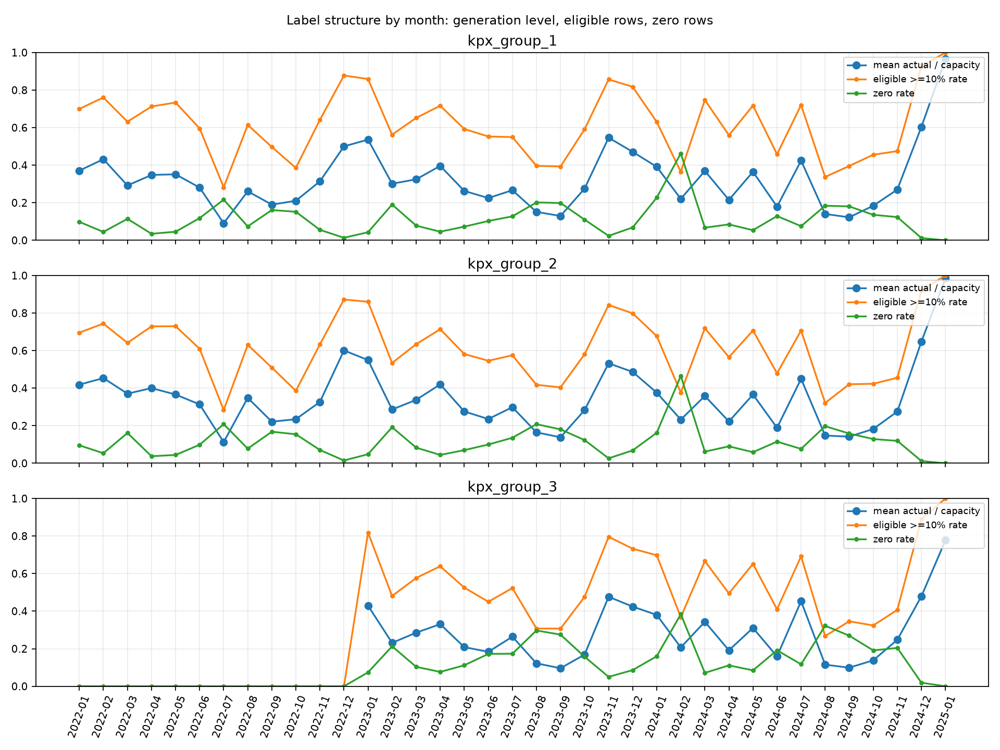
3. 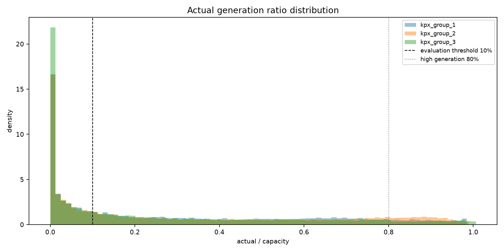
4. 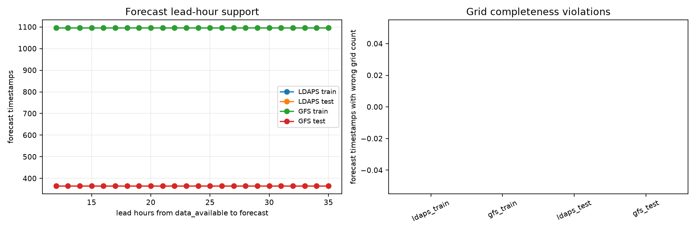
5. 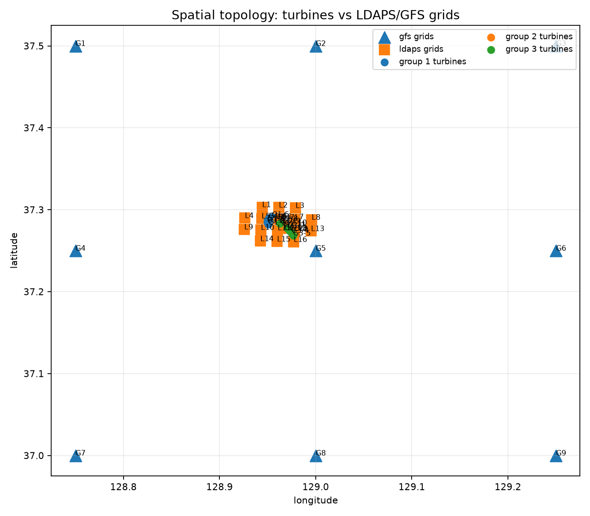
6. 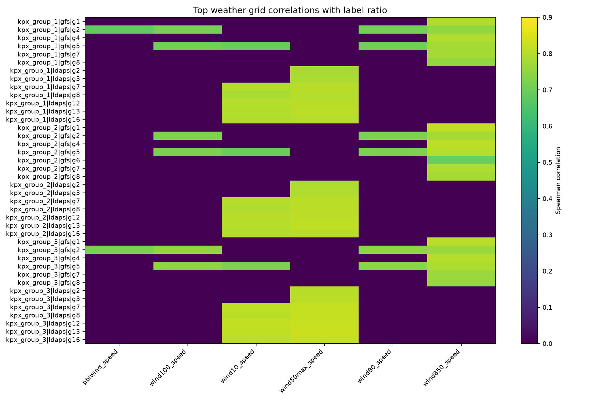
7. 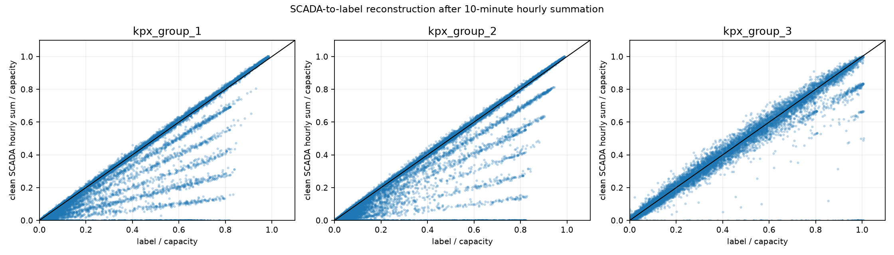
8. 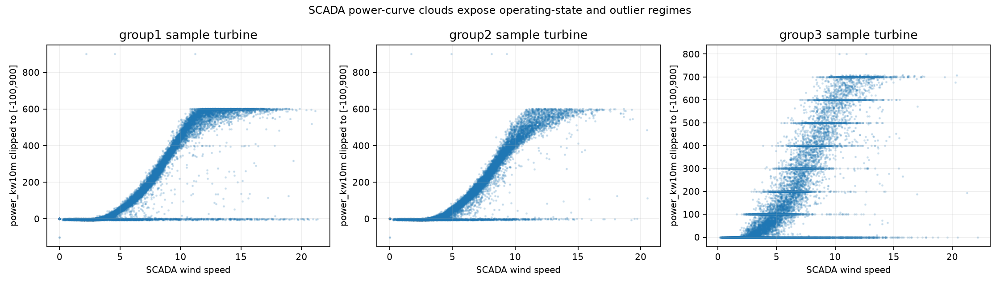
9. 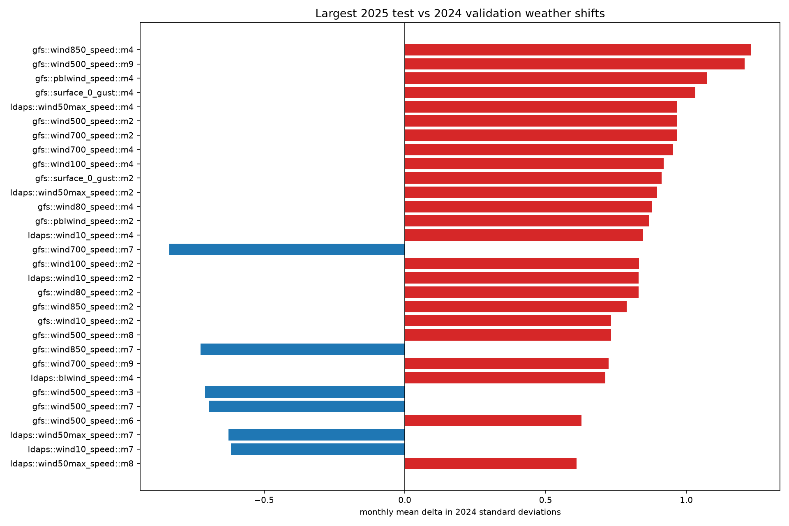
10. 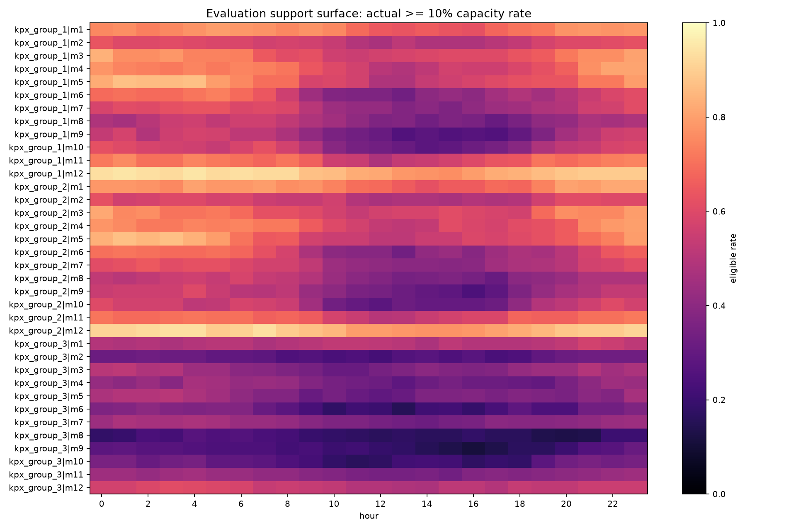
11. 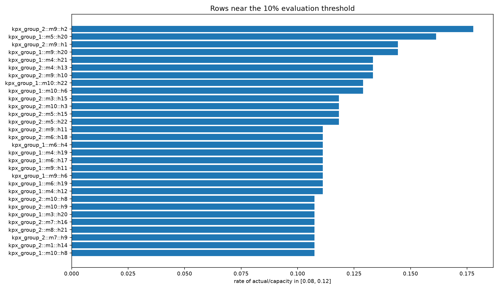

## Main Findings

- EDA was not absent, but it was fragmented. This run produces a single atlas that can be used before further modeling.
- The label surface is highly group/year/month dependent. Group 3 has no 2022 labels and a higher zero/near-zero share; it should not inherit group 1/2 assumptions by default.
- The forecast-time contract is mechanically regular and must be treated as an issue-cycle/lead-hour problem, not a generic row-level time series.
- Spatial topology is a first-class axis: nearest grid, highest-correlation grid, and source-specific grid resolution need to be audited before feature dumping.
- SCADA hourly summation strongly reconstructs labels after treating `power_kw10m` as a 10-minute value. The remaining residual should be the next EDA target because it is the closest observable proxy for label generation and operating state.
- 2025 weather shift is not uniform; some monthly wind regimes are far from 2024 validation. Any public-submission decision should carry a 2025 exposure audit.
- FiCR-sensitive rows are concentrated around eligibility and band boundaries. Model error analysis should be routed through these surfaces rather than through average MAE alone.

## Forecast-Time Contract

| dataset     |   rows |   forecast_times |   expected_grids |   min_grids_per_time |   max_grids_per_time |   bad_grid_count_times |   lead_min |   lead_max | lead_unique                                                             |
|:------------|-------:|-----------------:|-----------------:|---------------------:|---------------------:|-----------------------:|-----------:|-----------:|:------------------------------------------------------------------------|
| ldaps_train | 420864 |            26304 |               16 |                   16 |                   16 |                      0 |         12 |         35 | 12,13,14,15,16,17,18,19,20,21,22,23,24,25,26,27,28,29,30,31,32,33,34,35 |
| gfs_train   | 236736 |            26304 |                9 |                    9 |                    9 |                      0 |         12 |         35 | 12,13,14,15,16,17,18,19,20,21,22,23,24,25,26,27,28,29,30,31,32,33,34,35 |
| ldaps_test  | 140160 |             8760 |               16 |                   16 |                   16 |                      0 |         12 |         35 | 12,13,14,15,16,17,18,19,20,21,22,23,24,25,26,27,28,29,30,31,32,33,34,35 |
| gfs_test    |  78840 |             8760 |                9 |                    9 |                    9 |                      0 |         12 |         35 | 12,13,14,15,16,17,18,19,20,21,22,23,24,25,26,27,28,29,30,31,32,33,34,35 |

## Label Monthly Distribution: Largest Missing/Edge Slices

| target      |   year |   month |   rows |   missing_rate |   mean_ratio |   p50_ratio |   p90_ratio |   zero_rate |   eligible_10pct_rate |   high_80pct_rate |   capacity_exceed |
|:------------|-------:|--------:|-------:|---------------:|-------------:|------------:|------------:|------------:|----------------------:|------------------:|------------------:|
| kpx_group_3 |   2022 |       1 |    743 |              1 |          nan |         nan |         nan |           0 |                     0 |                 0 |                 0 |
| kpx_group_3 |   2022 |       2 |    672 |              1 |          nan |         nan |         nan |           0 |                     0 |                 0 |                 0 |
| kpx_group_3 |   2022 |       3 |    744 |              1 |          nan |         nan |         nan |           0 |                     0 |                 0 |                 0 |
| kpx_group_3 |   2022 |       4 |    720 |              1 |          nan |         nan |         nan |           0 |                     0 |                 0 |                 0 |
| kpx_group_3 |   2022 |       5 |    744 |              1 |          nan |         nan |         nan |           0 |                     0 |                 0 |                 0 |
| kpx_group_3 |   2022 |       6 |    720 |              1 |          nan |         nan |         nan |           0 |                     0 |                 0 |                 0 |
| kpx_group_3 |   2022 |       7 |    744 |              1 |          nan |         nan |         nan |           0 |                     0 |                 0 |                 0 |
| kpx_group_3 |   2022 |       8 |    744 |              1 |          nan |         nan |         nan |           0 |                     0 |                 0 |                 0 |
| kpx_group_3 |   2022 |       9 |    720 |              1 |          nan |         nan |         nan |           0 |                     0 |                 0 |                 0 |
| kpx_group_3 |   2022 |      10 |    744 |              1 |          nan |         nan |         nan |           0 |                     0 |                 0 |                 0 |
| kpx_group_3 |   2022 |      11 |    720 |              1 |          nan |         nan |         nan |           0 |                     0 |                 0 |                 0 |
| kpx_group_3 |   2022 |      12 |    744 |              1 |          nan |         nan |         nan |           0 |                     0 |                 0 |                 0 |

## Top Weather-Label Correlations

| target      | source   |   grid_id | wind_feature    |   spearman_corr |     n |
|:------------|:---------|----------:|:----------------|----------------:|------:|
| kpx_group_3 | ldaps    |        13 | wind50max_speed |        0.826312 | 17538 |
| kpx_group_3 | ldaps    |        12 | wind50max_speed |        0.823962 | 17538 |
| kpx_group_3 | ldaps    |        16 | wind50max_speed |        0.821103 | 17538 |
| kpx_group_3 | ldaps    |         7 | wind50max_speed |        0.820869 | 17538 |
| kpx_group_3 | ldaps    |         8 | wind50max_speed |        0.820294 | 17538 |
| kpx_group_3 | ldaps    |        12 | wind10_speed    |        0.81673  | 17538 |
| kpx_group_3 | ldaps    |         7 | wind10_speed    |        0.813883 | 17538 |
| kpx_group_3 | ldaps    |        13 | wind10_speed    |        0.813496 | 17538 |
| kpx_group_2 | ldaps    |        13 | wind50max_speed |        0.812794 | 26201 |
| kpx_group_2 | gfs      |         1 | wind850_speed   |        0.812383 | 26201 |
| kpx_group_3 | ldaps    |        16 | wind10_speed    |        0.811637 | 17538 |
| kpx_group_2 | gfs      |         4 | wind850_speed   |        0.810914 | 26201 |
| kpx_group_2 | ldaps    |        12 | wind50max_speed |        0.80951  | 26201 |
| kpx_group_2 | ldaps    |         7 | wind50max_speed |        0.808276 | 26201 |
| kpx_group_2 | ldaps    |         8 | wind50max_speed |        0.807658 | 26201 |
| kpx_group_1 | ldaps    |        13 | wind50max_speed |        0.8075   | 26200 |
| kpx_group_3 | ldaps    |         8 | wind10_speed    |        0.806757 | 17538 |
| kpx_group_3 | gfs      |         1 | wind850_speed   |        0.805694 | 17538 |

## Nearest Grid Samples

| turbine   |   group | source   |   grid_id |   distance_km_approx |
|:----------|--------:|:---------|----------:|---------------------:|
| VESTAS_07 |       2 | ldaps    |         6 |             0.161357 |
| VESTAS_08 |       2 | ldaps    |         6 |             0.31906  |
| VESTAS_06 |       1 | ldaps    |         6 |             0.35792  |
| UNISON_04 |       3 | ldaps    |        12 |             0.401504 |
| UNISON_03 |       3 | ldaps    |        12 |             0.428788 |
| VESTAS_12 |       2 | ldaps    |        11 |             0.613816 |
| VESTAS_03 |       1 | ldaps    |         5 |             0.618413 |
| UNISON_01 |       3 | ldaps    |         6 |             0.628975 |
| VESTAS_05 |       1 | ldaps    |         6 |             0.643244 |
| VESTAS_04 |       1 | ldaps    |         5 |             0.645544 |
| UNISON_05 |       3 | ldaps    |        12 |             0.667629 |
| VESTAS_09 |       2 | ldaps    |         6 |             0.723172 |
| VESTAS_11 |       2 | ldaps    |        11 |             0.738811 |
| UNISON_02 |       3 | ldaps    |        12 |             0.744588 |
| VESTAS_02 |       1 | ldaps    |         5 |             0.751761 |
| UNISON_05 |       3 | ldaps    |        16 |             0.874101 |
| VESTAS_04 |       1 | ldaps    |         6 |             0.884391 |
| VESTAS_12 |       2 | ldaps    |        12 |             0.920574 |

## SCADA Reconstruction Summary

| maker   | target      | kind   |   rows |   pearson_corr |   median_scada_over_label |   mae_ratio |
|:--------|:------------|:-------|-------:|---------------:|--------------------------:|------------:|
| VESTAS  | kpx_group_1 | raw    |  26200 |    0.000991069 |                  1.01477  |   9.42675   |
| VESTAS  | kpx_group_1 | clean  |  26200 |    0.949145    |                  1.00303  |   0.0331964 |
| VESTAS  | kpx_group_2 | raw    |  26201 |   -0.000335293 |                  1.01097  |  11.0892    |
| VESTAS  | kpx_group_2 | clean  |  26201 |    0.948605    |                  0.998386 |   0.0354037 |
| UNISON  | kpx_group_3 | raw    |  17538 |    0.978977    |                  0.996114 |   0.0175332 |
| UNISON  | kpx_group_3 | clean  |  17538 |    0.975066    |                  0.992883 |   0.0208882 |

## Largest 2025-vs-2024 Weather Shifts

| source   | feature         |   month |   train2024_mean |   test2025_mean |   z_delta_vs_2024 |   test_above_train_p90_rate |
|:---------|:----------------|--------:|-----------------:|----------------:|------------------:|----------------------------:|
| gfs      | wind850_speed   |       4 |          5.71644 |        10.7275  |          1.22955  |                    0.417593 |
| gfs      | wind500_speed   |       9 |         11.0367  |        17.6762  |          1.20736  |                    0.551852 |
| gfs      | pblwind_speed   |       4 |          3.33681 |         6.31304 |          1.07342  |                    0.351698 |
| gfs      | surface_0_gust  |       4 |          3.41844 |         6.10265 |          1.03199  |                    0.358642 |
| ldaps    | wind50max_speed |       4 |          6.02248 |         8.97816 |          0.967618 |                    0.414551 |
| gfs      | wind500_speed   |       2 |         22.622   |        30.0214  |          0.967285 |                    0.31994  |
| gfs      | wind700_speed   |       2 |         11.9904  |        17.0439  |          0.966332 |                    0.360284 |
| gfs      | wind700_speed   |       4 |          8.98449 |        14.8703  |          0.951978 |                    0.396605 |
| gfs      | wind100_speed   |       4 |          3.30093 |         5.18356 |          0.918604 |                    0.345216 |
| gfs      | surface_0_gust  |       2 |          3.78677 |         6.69362 |          0.912329 |                    0.323247 |
| ldaps    | wind50max_speed |       2 |          6.91582 |        10.4582  |          0.895275 |                    0.325614 |
| gfs      | wind80_speed    |       4 |          3.20404 |         4.9454  |          0.877445 |                    0.334722 |
| gfs      | pblwind_speed   |       2 |          3.76606 |         6.81883 |          0.866457 |                    0.309358 |
| ldaps    | wind10_speed    |       4 |          4.08304 |         5.61815 |          0.844679 |                    0.356163 |
| gfs      | wind700_speed   |       7 |         13.5058  |         6.28536 |         -0.836608 |                    0        |
| gfs      | wind100_speed   |       2 |          3.50666 |         5.54931 |          0.832302 |                    0.273479 |
| ldaps    | wind10_speed    |       2 |          4.65843 |         6.6457  |          0.8306   |                    0.301711 |
| gfs      | wind80_speed    |       2 |          3.37198 |         5.30702 |          0.829557 |                    0.272321 |

## Open EDA Work Items

1. Build a column-level data dictionary artifact for every numeric weather column: unit/range/missing/train-test parity/physical transform.
2. Convert SCADA-label reconstruction residuals into event taxonomy: outage, curtailment, forecast miss, aggregation mismatch, and group-level reporting residual.
3. Redo spatial features from topology: group/turbine distance, wind-direction conditioned upstream grids, and source-specific height choices.
4. Create a 2025 exposure risk score using only label-relevant features, not all weather columns equally.
5. Map current best model residuals onto this atlas: label regime, SCADA residual regime, spatial regime, lead-hour, and FiCR boundary.
6. Treat group 3 as a separate data problem until evidence supports shared modeling.

## Files

- `column_contract_audit.csv`
- `forecast_time_contract_summary.csv`
- `info_turbine_metadata_parsed.csv`
- `turbine_grid_distance_matrix.csv`
- `weather_grid_label_correlations.csv`
- `scada_label_reconstruction_summary.csv`
- `test2025_vs_valid2024_feature_shift.csv`
- `ficr_sensitive_label_surface.csv`
