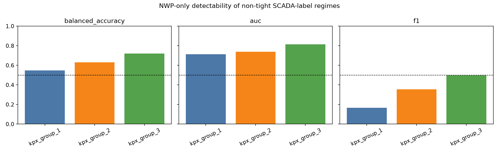
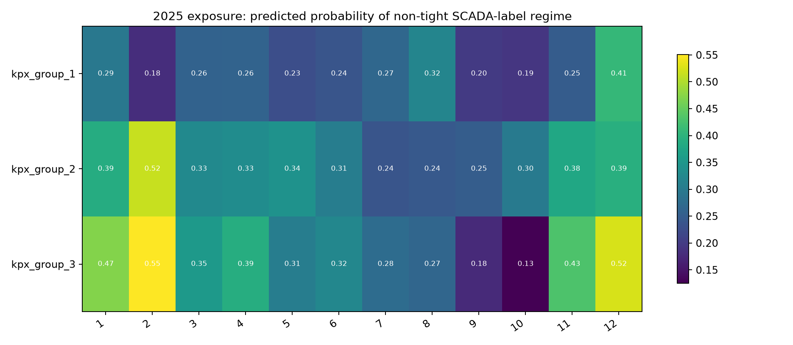
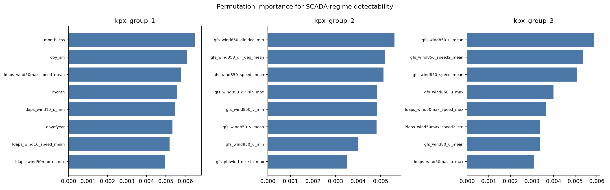
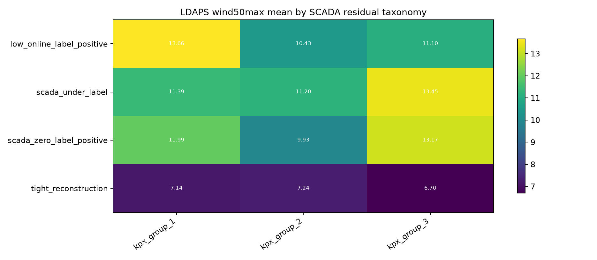
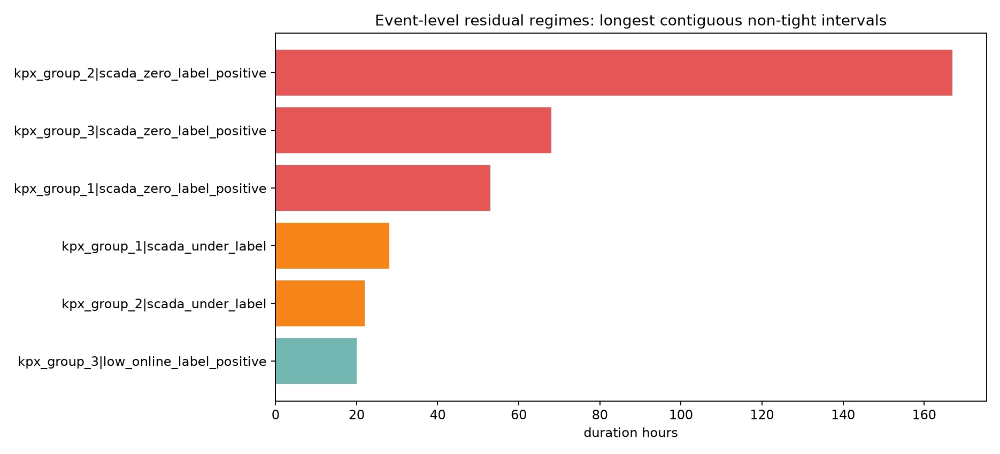
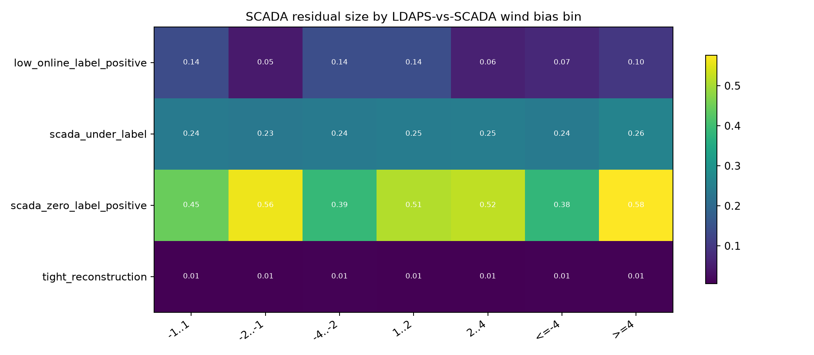
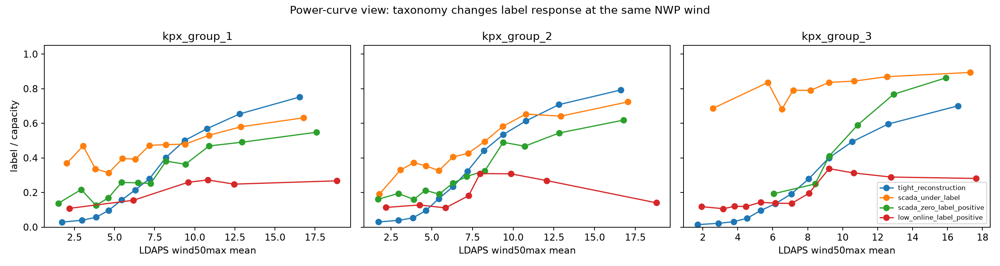
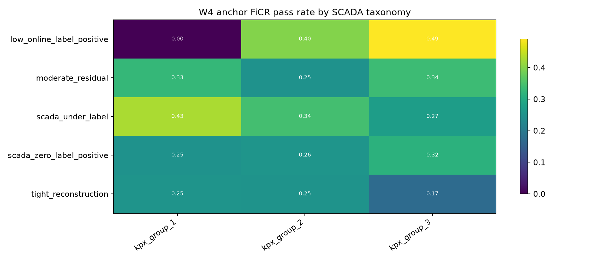

# SCADA Residual Deployability EDA

This EDA tests whether the SCADA-to-label lessons from issue #31 are deployable from test-time available NWP/time features.
SCADA is used only as a teacher label for train-time taxonomy; the classifier and 2025 exposure use LDAPS/GFS/time features only.

## Figures

1. 
2. 
3. 
4. 
5. 
6. 
7. 
8. 

## 1. NWP-only Detectability

| target      |   balanced_accuracy |      auc |       f1 |   positive_rate_valid |
|:------------|--------------------:|---------:|---------:|----------------------:|
| kpx_group_1 |            0.548089 | 0.712741 | 0.166014 |              0.076555 |
| kpx_group_2 |            0.629903 | 0.737892 | 0.354839 |              0.132832 |
| kpx_group_3 |            0.720348 | 0.813824 | 0.496597 |              0.181249 |

Interpretation: detectability is real but uneven. Group2/group3 show stronger binary separation than group1; group3's headline score is high, but it rests on 2023-only training because 2022 labels are absent. This supports using SCADA taxonomy as a teacher, but not as a direct submission rule.

Validity discussion: the split is chronological, training on 2022-2023 and validating on 2024. For group3, training is 2023 only because 2022 labels are absent. The target is binary non-tight vs tight reconstruction to avoid overclaiming fine-grained causal labels.

Top NWP-only features by permutation importance:

| target      | feature                    |   importance_mean |   importance_std |
|:------------|:---------------------------|------------------:|-----------------:|
| kpx_group_1 | month_cos                  |        0.00651215 |      0.00232048  |
| kpx_group_1 | doy_sin                    |        0.00607729 |      0.00204543  |
| kpx_group_1 | ldaps_wind50max_speed_mean |        0.00577427 |      0.00165586  |
| kpx_group_1 | month                      |        0.00555684 |      0.000860145 |
| kpx_group_1 | ldaps_wind10_u_min         |        0.00547434 |      0.00122133  |
| kpx_group_2 | gfs_wind850_dir_deg_min    |        0.00561923 |      0.00146438  |
| kpx_group_2 | gfs_wind850_dir_deg_mean   |        0.0051867  |      0.00175966  |
| kpx_group_2 | gfs_wind850_speed_mean     |        0.00512448 |      0.00180115  |
| kpx_group_2 | gfs_wind850_dir_sin_max    |        0.00485009 |      0.00161781  |
| kpx_group_2 | gfs_wind850_v_min          |        0.0048491  |      0.00116499  |
| kpx_group_3 | gfs_wind850_u_mean         |        0.00586316 |      0.000683408 |
| kpx_group_3 | gfs_wind850_speed2_mean    |        0.00537186 |      0.00076062  |
| kpx_group_3 | gfs_wind850_speed_mean     |        0.00509262 |      0.00119298  |
| kpx_group_3 | gfs_wind850_u_max          |        0.00399099 |      0.000691294 |
| kpx_group_3 | ldaps_wind50max_speed_max  |        0.00363882 |      0.000898792 |

## 2. 2025 Exposure

| target      |   month |   non_tight_probability |
|:------------|--------:|------------------------:|
| kpx_group_3 |       2 |                0.550459 |
| kpx_group_3 |      12 |                0.524983 |
| kpx_group_2 |       2 |                0.515233 |
| kpx_group_3 |       1 |                0.471364 |
| kpx_group_3 |      11 |                0.431216 |
| kpx_group_1 |      12 |                0.407676 |
| kpx_group_2 |      12 |                0.393864 |
| kpx_group_3 |       4 |                0.389482 |
| kpx_group_2 |       1 |                0.388732 |
| kpx_group_2 |      11 |                0.377826 |
| kpx_group_3 |       3 |                0.354859 |
| kpx_group_2 |       5 |                0.341899 |

Interpretation: the deployable risk is month- and group-concentrated. A candidate that adjusts SCADA-derived residual regimes should carry this exposure surface; a 2024-only gain is not enough if the target months are over- or under-exposed in 2025.

Validity discussion: these are classifier probabilities, not observed 2025 SCADA states. They are suitable for submission-risk triage, not for proving public score.

## 3. Taxonomy Weather Surface

| target      | taxonomy                  |   rows |   ldaps_wind50max_speed_mean_mean |   gfs_wind850_speed_mean_mean |
|:------------|:--------------------------|-------:|----------------------------------:|------------------------------:|
| kpx_group_1 | low_online_label_positive |     27 |                          13.6603  |                      16.5821  |
| kpx_group_1 | scada_under_label         |   1296 |                          11.3927  |                      12.9186  |
| kpx_group_1 | scada_zero_label_positive |    529 |                          11.9943  |                      14.7168  |
| kpx_group_1 | tight_reconstruction      |  22693 |                           7.14211 |                       7.58434 |
| kpx_group_2 | low_online_label_positive |     12 |                          10.4303  |                      11.8862  |
| kpx_group_2 | scada_under_label         |   1098 |                          11.1967  |                      13.1309  |
| kpx_group_2 | scada_zero_label_positive |    868 |                           9.92605 |                      11.6338  |
| kpx_group_2 | tight_reconstruction      |  21962 |                           7.24263 |                       7.68104 |
| kpx_group_3 | low_online_label_positive |    260 |                          11.095   |                      13.3343  |
| kpx_group_3 | scada_under_label         |    341 |                          13.4467  |                      16.6758  |
| kpx_group_3 | scada_zero_label_positive |     94 |                          13.1708  |                      16.4603  |
| kpx_group_3 | tight_reconstruction      |  14493 |                           6.70013 |                       6.97632 |

Interpretation: SCADA residual regimes occupy different NWP wind surfaces, but overlap remains substantial. This justifies gated/probabilistic actions rather than hard taxonomy replacement.

Validity discussion: weather summaries are descriptive and do not prove separability by themselves. They are paired with the chronological classifier above.

## 4. Event-level Structure

| target      | taxonomy                  | start               | end                 |   duration_hours |   mean_abs_residual_ratio |   ldaps_event_minus_context |   gfs_event_minus_context |
|:------------|:--------------------------|:--------------------|:--------------------|-----------------:|--------------------------:|----------------------------:|--------------------------:|
| kpx_group_2 | scada_zero_label_positive | 2022-01-31 13:00:00 | 2022-02-07 11:00:00 |              167 |                  0.61555  |                   6.36268   |                   9.55934 |
| kpx_group_3 | scada_zero_label_positive | 2024-02-12 14:00:00 | 2024-02-15 09:00:00 |               68 |                  0.812631 |                   6.1653    |                  10.0282  |
| kpx_group_2 | scada_zero_label_positive | 2022-02-14 21:00:00 | 2022-02-17 10:00:00 |               62 |                  0.654449 |                  10.0328    |                  11.513   |
| kpx_group_2 | scada_zero_label_positive | 2022-02-20 16:00:00 | 2022-02-23 00:00:00 |               57 |                  0.554738 |                   2.63126   |                   6.89571 |
| kpx_group_1 | scada_zero_label_positive | 2022-12-17 16:00:00 | 2022-12-19 20:00:00 |               53 |                  0.474816 |                   3.96189   |                   9.2016  |
| kpx_group_1 | scada_zero_label_positive | 2022-01-16 15:00:00 | 2022-01-18 13:00:00 |               47 |                  0.573137 |                   2.1296    |                   2.41157 |
| kpx_group_1 | scada_zero_label_positive | 2022-12-14 04:00:00 | 2022-12-15 11:00:00 |               32 |                  0.495309 |                  -1.17898   |                   2.73477 |
| kpx_group_1 | scada_under_label         | 2022-08-03 07:00:00 | 2022-08-04 10:00:00 |               28 |                  0.405676 |                   0.380694  |                   1.14773 |
| kpx_group_1 | scada_under_label         | 2023-01-20 12:00:00 | 2023-01-21 12:00:00 |               25 |                  0.394255 |                  -0.0156292 |                  -1.25018 |
| kpx_group_1 | scada_zero_label_positive | 2022-03-04 17:00:00 | 2022-03-05 16:00:00 |               24 |                  0.438414 |                   9.3336    |                  12.5379  |

Interpretation: residual regimes include long contiguous events, so they are not just independent row noise. Some events show clear NWP context shifts; others do not, which is exactly why any deployable correction must be guarded.

Validity discussion: without external operation logs, event labels remain observable signatures, not causal outage/curtailment proof.

## 5. NWP-to-SCADA Bias

| target      | taxonomy                  | bias_bin   |   rows |   mean_abs_residual_ratio |   mean_ldaps_speed_bias |
|:------------|:--------------------------|:-----------|-------:|--------------------------:|------------------------:|
| kpx_group_3 | scada_zero_label_positive | -2..-1     |      3 |                  0.922199 |              -1.59299   |
| kpx_group_3 | scada_zero_label_positive | 1..2       |     23 |                  0.804697 |               1.52488   |
| kpx_group_3 | scada_zero_label_positive | >=4        |    103 |                  0.724134 |               6.8446    |
| kpx_group_3 | scada_zero_label_positive | 2..4       |     38 |                  0.679768 |               3.03348   |
| kpx_group_3 | scada_zero_label_positive | -1..1      |     21 |                  0.618931 |               0.0613443 |
| kpx_group_2 | scada_zero_label_positive | >=4        |    468 |                  0.522192 |               7.01062   |
| kpx_group_1 | scada_zero_label_positive | >=4        |    443 |                  0.480874 |               7.86354   |
| kpx_group_1 | scada_zero_label_positive | 2..4       |    169 |                  0.448535 |               2.94851   |
| kpx_group_2 | scada_zero_label_positive | 2..4       |    246 |                  0.435079 |               2.94179   |
| kpx_group_1 | scada_zero_label_positive | <=-4       |     27 |                  0.430919 |              -5.73108   |
| kpx_group_1 | scada_zero_label_positive | -2..-1     |     69 |                  0.428837 |              -1.49564   |
| kpx_group_1 | scada_zero_label_positive | -4..-2     |     65 |                  0.392831 |              -2.80168   |
| kpx_group_2 | scada_zero_label_positive | -4..-2     |    226 |                  0.381806 |              -2.83295   |
| kpx_group_1 | scada_zero_label_positive | -1..1      |    173 |                  0.377826 |              -0.0537807 |
| kpx_group_2 | scada_zero_label_positive | 1..2       |    158 |                  0.365319 |               1.50022   |

Interpretation: large SCADA-label residuals concentrate in specific NWP-vs-SCADA wind-bias bins. This is the strongest route for converting SCADA teacher knowledge into test-time features: estimate NWP measurement bias, then act only where the score direction is stable.

Validity discussion: the bias itself is measured with train-only SCADA, so test deployment must use NWP-only proxies for the bias regime.

## 6. Power-curve Regime

| target      | taxonomy                  |   wind_center |   rows |   mean_label_ratio |   mean_scada_ratio |   mean_residual_ratio |
|:------------|:--------------------------|--------------:|-------:|-------------------:|-------------------:|----------------------:|
| kpx_group_1 | tight_reconstruction      |       1.72513 |   2087 |          0.0288623 |         0.0269893  |          -0.00187306  |
| kpx_group_1 | tight_reconstruction      |       2.9662  |   2075 |          0.0394068 |         0.0374946  |          -0.00191216  |
| kpx_group_1 | tight_reconstruction      |       3.85617 |   2085 |          0.0568208 |         0.0547675  |          -0.00205331  |
| kpx_group_1 | tight_reconstruction      |       4.63673 |   2033 |          0.0969332 |         0.0954195  |          -0.00151372  |
| kpx_group_1 | scada_under_label         |       4.64127 |     23 |          0.314096  |         0.13443    |          -0.179666    |
| kpx_group_1 | tight_reconstruction      |       5.43413 |   1969 |          0.156381  |         0.155028   |          -0.00135286  |
| kpx_group_1 | scada_under_label         |       5.49673 |     40 |          0.396481  |         0.143235   |          -0.253246    |
| kpx_group_1 | tight_reconstruction      |       6.28965 |   1899 |          0.214715  |         0.214032   |          -0.000682965 |
| kpx_group_1 | scada_under_label         |       6.30393 |     72 |          0.393022  |         0.173089   |          -0.219933    |
| kpx_group_1 | scada_under_label         |       7.17402 |    104 |          0.472255  |         0.212228   |          -0.260027    |
| kpx_group_1 | tight_reconstruction      |       7.17815 |   1832 |          0.279475  |         0.280164   |           0.000688913 |
| kpx_group_1 | scada_zero_label_positive |       7.25324 |     27 |          0.252138  |         0.00552984 |          -0.246608    |
| kpx_group_1 | tight_reconstruction      |       8.20243 |   1817 |          0.402448  |         0.405663   |           0.0032145   |
| kpx_group_1 | scada_under_label         |       8.20587 |    125 |          0.476802  |         0.209274   |          -0.267528    |
| kpx_group_1 | scada_zero_label_positive |       8.20954 |     47 |          0.381367  |         0.00396178 |          -0.377406    |
| kpx_group_1 | tight_reconstruction      |       9.37372 |   1839 |          0.500755  |         0.506182   |           0.00542703  |
| kpx_group_1 | scada_under_label         |       9.39373 |    141 |          0.479327  |         0.226224   |          -0.253103    |
| kpx_group_1 | scada_zero_label_positive |       9.41835 |     49 |          0.363219  |         0.00214191 |          -0.361077    |
| kpx_group_1 | tight_reconstruction      |      10.7695  |   1803 |          0.569029  |         0.576181   |           0.00715179  |
| kpx_group_1 | scada_under_label         |      10.8853  |    163 |          0.530661  |         0.245096   |          -0.285565    |

Interpretation: at comparable NWP wind speeds, taxonomy changes the label response. That means a single smooth NWP power curve is structurally insufficient for all regimes.

Validity discussion: qcut bins make the curve stable enough for EDA, but the figure should be read as regime diagnosis, not a calibrated postprocessor.

## 7. FiCR Boundary

| target      | taxonomy                  |   rows |   eligible_rows |   ficr_pass_rate |   ficr_gold_rate |   near_10_actual_rows |   near_16_pred_rows |   mean_abs_err_norm |
|:------------|:--------------------------|-------:|----------------:|-----------------:|-----------------:|----------------------:|--------------------:|--------------------:|
| kpx_group_1 | low_online_label_positive |      4 |               4 |         0        |         0        |                     2 |                   0 |           0.347573  |
| kpx_group_3 | tight_reconstruction      |   7187 |            3015 |         0.172116 |         0.135801 |                   401 |                 407 |           0.0915074 |
| kpx_group_2 | moderate_residual         |    715 |             430 |         0.248951 |         0.188811 |                   105 |                  51 |           0.127736  |
| kpx_group_1 | scada_zero_label_positive |     36 |              36 |         0.25     |         0.194444 |                     5 |                   1 |           0.162031  |
| kpx_group_2 | tight_reconstruction      |   7612 |            4095 |         0.252102 |         0.195744 |                   335 |                 262 |           0.0894372 |
| kpx_group_1 | tight_reconstruction      |   8106 |            4420 |         0.253022 |         0.198742 |                   406 |                 387 |           0.0951499 |
| kpx_group_2 | scada_zero_label_positive |    137 |             137 |         0.255474 |         0.189781 |                    36 |                   6 |           0.298459  |
| kpx_group_3 | scada_under_label         |    239 |             239 |         0.271967 |         0.238494 |                     0 |                   0 |           0.158703  |
| kpx_group_3 | scada_zero_label_positive |     92 |              92 |         0.315217 |         0.25     |                     3 |                   2 |           0.140552  |
| kpx_group_1 | moderate_residual         |    466 |             363 |         0.32618  |         0.227468 |                    33 |                  27 |           0.112413  |
| kpx_group_3 | moderate_residual         |   1158 |            1118 |         0.335924 |         0.259067 |                    21 |                  33 |           0.139554  |
| kpx_group_2 | scada_under_label         |    309 |             309 |         0.343042 |         0.236246 |                     0 |                   2 |           0.139228  |

Interpretation: the score-relevant question is not only whether a taxonomy has large MAE. It is whether it changes FiCR pass/gold rates near eligible rows and prediction floors. This keeps the SCADA lesson connected to the actual competition score.

Validity discussion: this uses the W4 diagnostic anchor, so it is a local score surface. It is valid for deciding what to test next, not enough by itself to authorize public submission.

## Conclusion

The additional EDA confirms the central lesson: SCADA residual regimes are partially deployable, not directly deployable. The evidence supports NWP-only gated residual/bias models, but group3 needs special caution despite its high 2024 binary detectability because its training evidence is 2023-only and its UNISON residual structure differs from VESTAS group1/2. Every score action still needs W3/cross-year confirmation.

What must be proven before a scoring experiment is promoted:
- Detectability: the SCADA residual regime can be inferred from NWP/time features on a chronological split.
- Directionality: the required prediction move is stable within that inferred regime.
- Score payoff: FiCR gain exceeds NMAE cost on W3/W4 or another independent split.